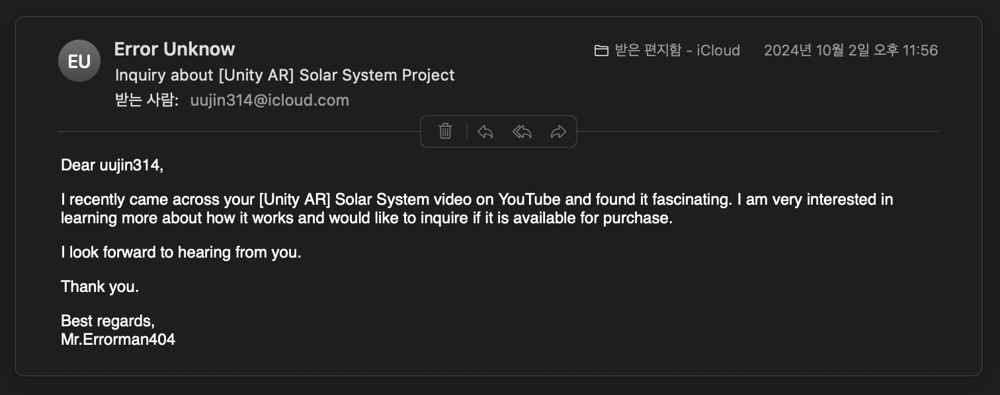
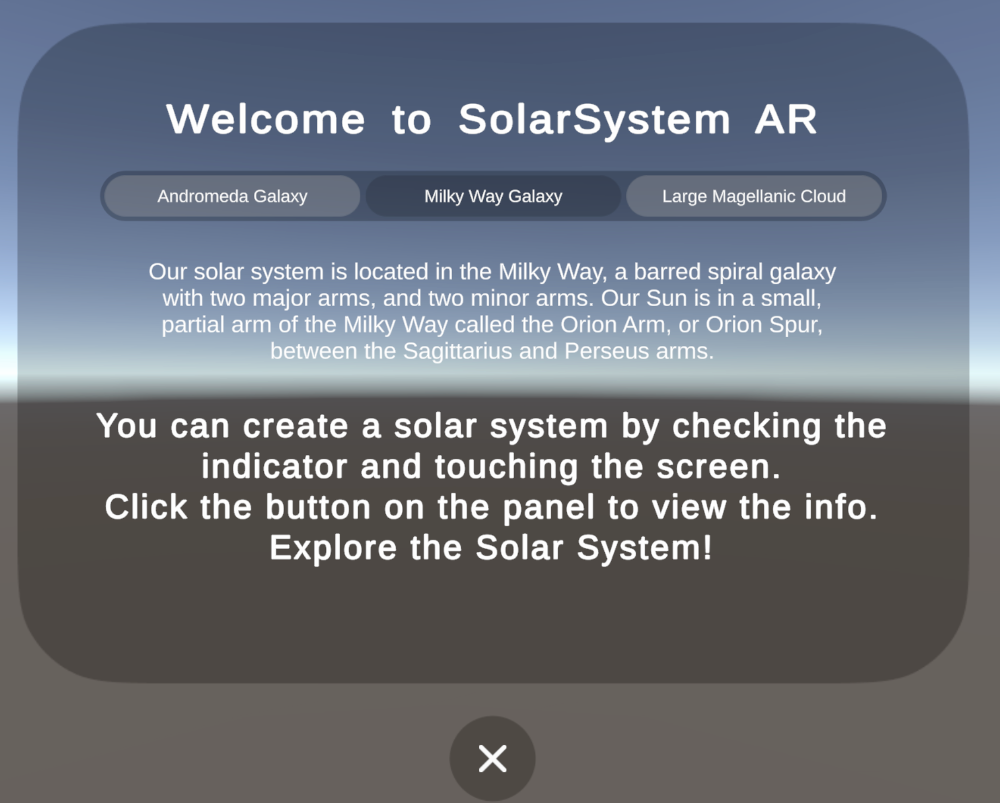
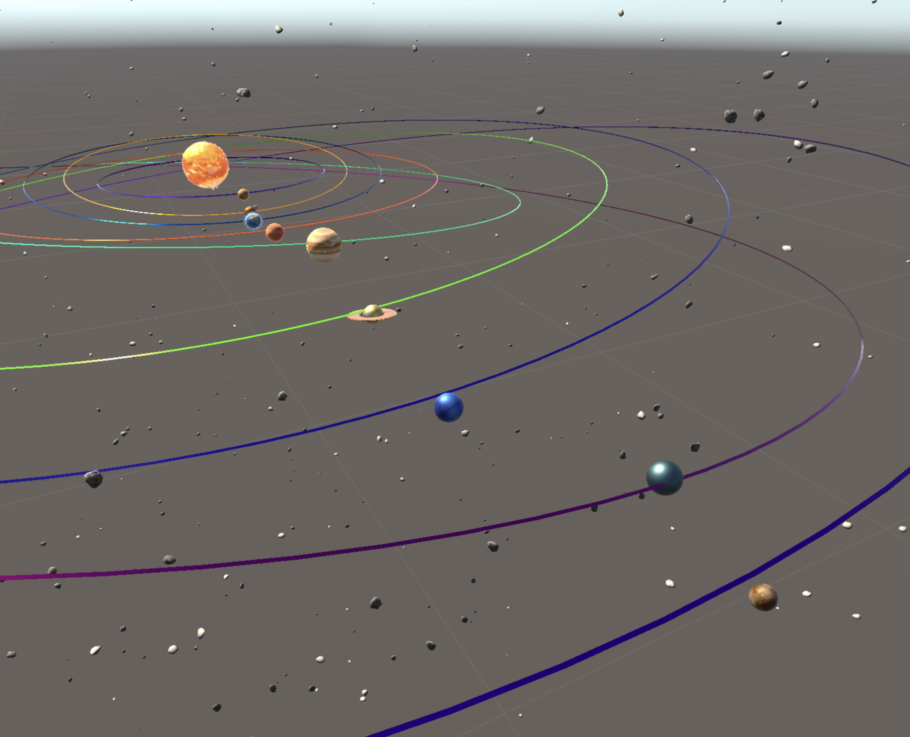
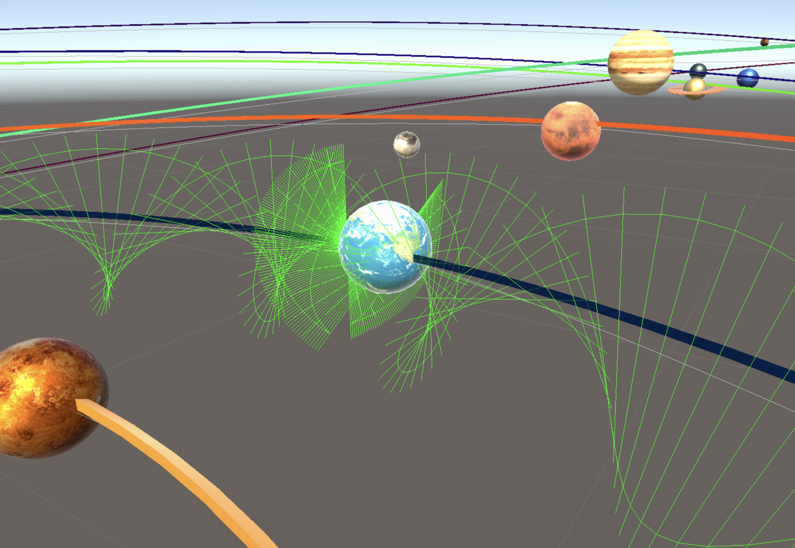
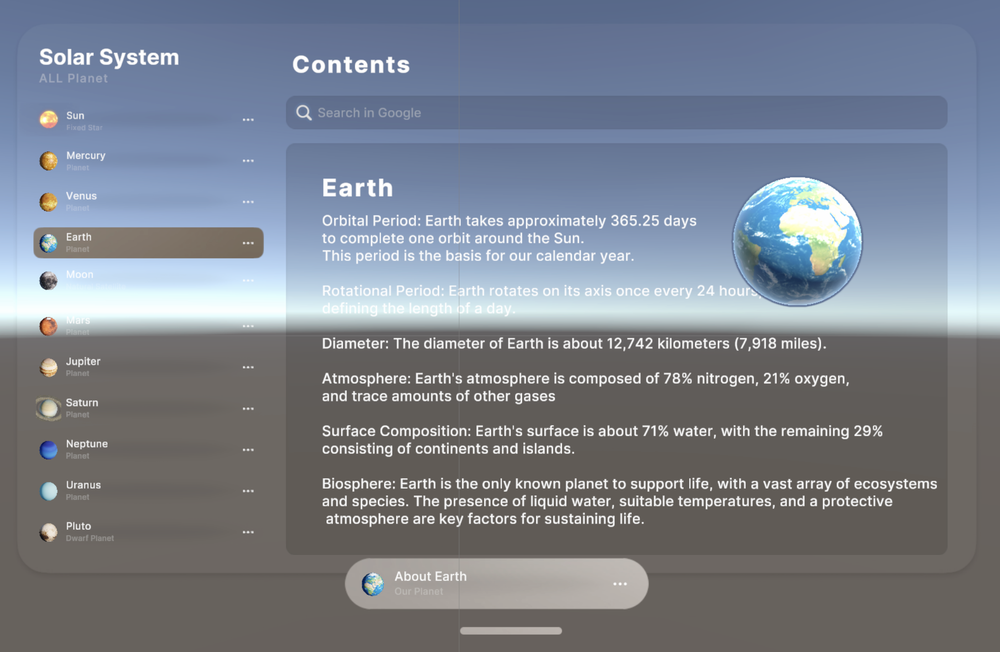

# 🌌 AR Solar System

**AR Solar System**은 현실 세계 위에 **태양계 전체를 증강**하여  
실제 공전 주기와 궤도에 따라 **행성들의 움직임을 관찰할 수 있는 AR 천체 시뮬레이션 앱**입니다.  

사용자는 화면을 터치해 태양계를 생성하고, 각 행성의 버튼을 클릭해  
**이름과 정보를 확인할 수 있는 UI**를 직관적으로 사용할 수 있습니다.

> 🎬 **데모 영상**  
>   

>  **1인 개발**  
>  **개발 기간:** 2024.05.18 ~ 2024.07.30

---

## 🌏 태국 교육 현장에서의 활용 사례

**AR Solar System**은 태국의 한 중등학교 교사가 메일로 직접 연락을 주셔서,  
**학생들의 우주 과학 수업에 활용된 사례**가 있습니다.

> "학생들이 실제 우주의 구조를 더 쉽게 이해할 수 있어 매우 유익했습니다."  
> – 태국 교사, 이메일 인용

  
  

이처럼 이 앱은 **글로벌 교육 현장에서도 실용적으로 활용**될 수 있으며,  
**AR 기반 우주 교육 콘텐츠의 확장 가능성**을 입증했습니다.

---

## 🖼️ 앱 인트로 화면

앱 실행 시 아래와 같은 **웰컴 이미지를 통해 기능 소개**가 제공됩니다.

  

---

## ✨ 핵심 기능

###  터치 기반 AR 태양계 생성

- AR Raycast를 활용해 사용자의 화면 터치 위치에 태양계를 증강합니다.
- 생성 위치는 **Indicator 오브젝트**로 시각화되어 사용자에게 배치 위치를 안내합니다.

---

###  정교한 태양계 및 소행성대 구성

- 태양과 행성, 지구의 위성인 달이 포함되어 있습니다.
- 추가로 **두 계층의 소행성대**가 구성되어 있으며, 시각적으로 밀도감 있게 표현됩니다.

  

---

###  실제 공전 주기 및 궤도 시뮬레이션

- Unity Cinemachine을 활용해 각 행성이 **실제 공전 주기와 거리 비율**에 맞춰 움직입니다.
- **달은 지구 주위를 공전하도록 별도로 처리**되며, 궤도의 폭 조절을 통해 입체감을 더했습니다.

  

---

###  행성 선택 UI (Scroll View)

- 하단 UI에 **스크롤 가능한 버튼**들이 배치되어 있어 각 행성을 쉽게 선택할 수 있습니다.
- 버튼 클릭 시 **행성 이름, 특징, 설명**이 포함된 Info UI가 팝업됩니다.

  

---

###  현실감을 더하는 그림자 효과

- 행성 아래에는 **ShadowMask Plane**이 적용되어,  
  AR 오브젝트가 현실 공간에 자연스럽게 정착한 듯한 인상을 줍니다.

---

###  Lerp 애니메이션을 활용한 UI 전환

- Info UI는 **Lerp 보간 애니메이션**을 통해 부드럽게 등장하며,  
  사용자 인터랙션에 따라 자연스럽게 전환됩니다.

---

## 🛠 사용 기술 스택

| 항목                     | 기술 내용                           |
|------------------------|------------------------------------|
| **엔진**               | Unity 2022.3 LTS                   |
| **AR 프레임워크**       | AR Foundation, ARKit               |
| **위치 인식**           | AR Raycast, Placement Indicator    |
| **UI 구성**             | Scroll View, Lerp Animation        |
| **그림자 처리**         | ShadowMask Plane                   |
| **도움말 패널**         | 이미지 기반 소개 / 정보 UI        |

---

##  기획 의도 & 개발 배경

> **“AR 기술로 태양계를 손안에”**

이 프로젝트는 AR 기술을 활용해 **천체의 움직임과 구조를 직접 눈으로 관찰**할 수 있도록 설계되었습니다.  
복잡한 천문학적 개념을 3D 시뮬레이션으로 시각화함으로써, **교육적 효과**는 물론,  
AR 인터페이스의 확장 가능성까지 탐색한 **개인 연구형 프로젝트**입니다.

---

## 📬 Contact

- 👨‍💻 개발자: **나우진**  
- 📧 이메일: [uujin314@icloud.com](mailto:uujin314@icloud.com)
